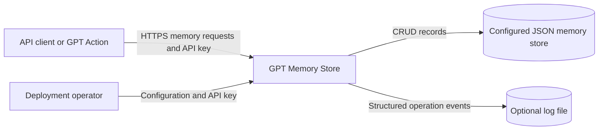
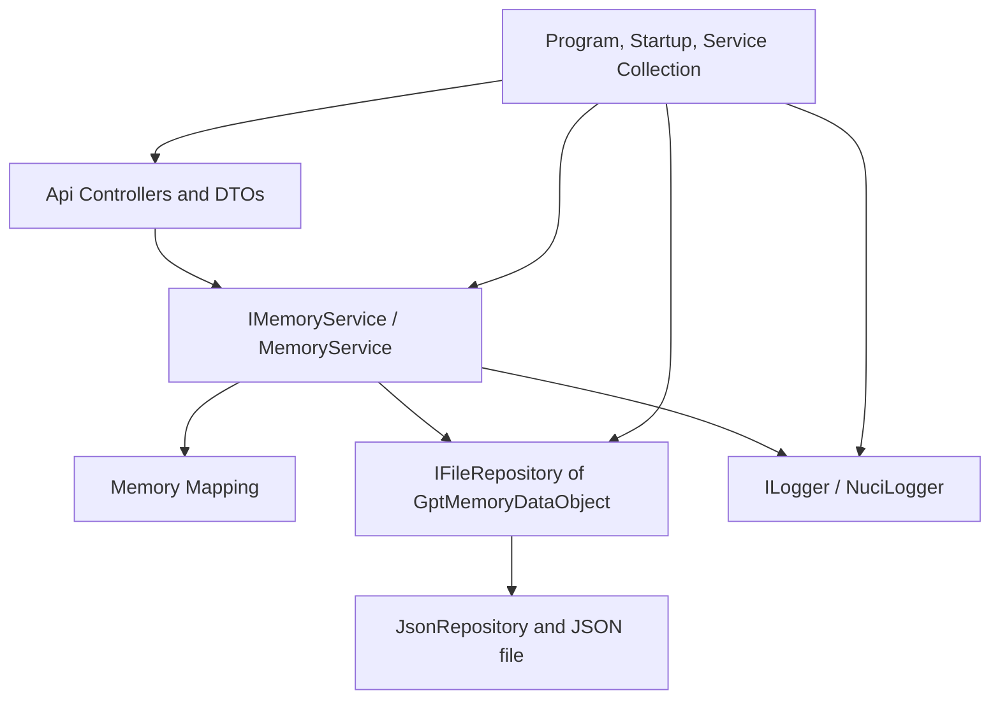
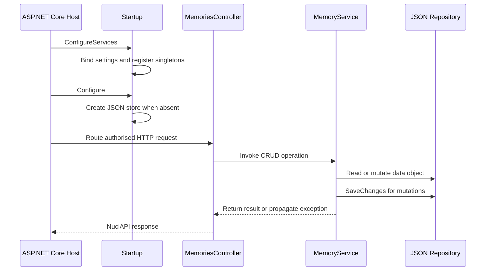
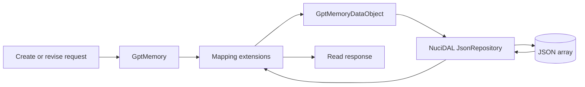
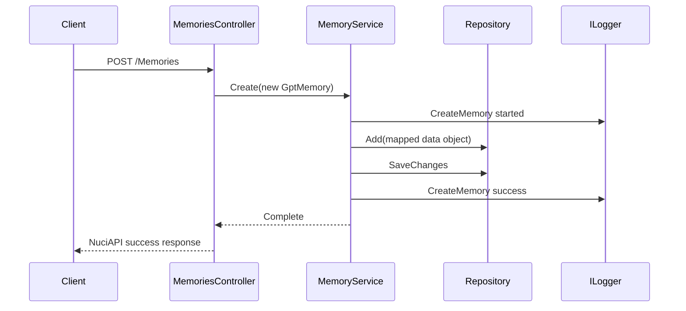
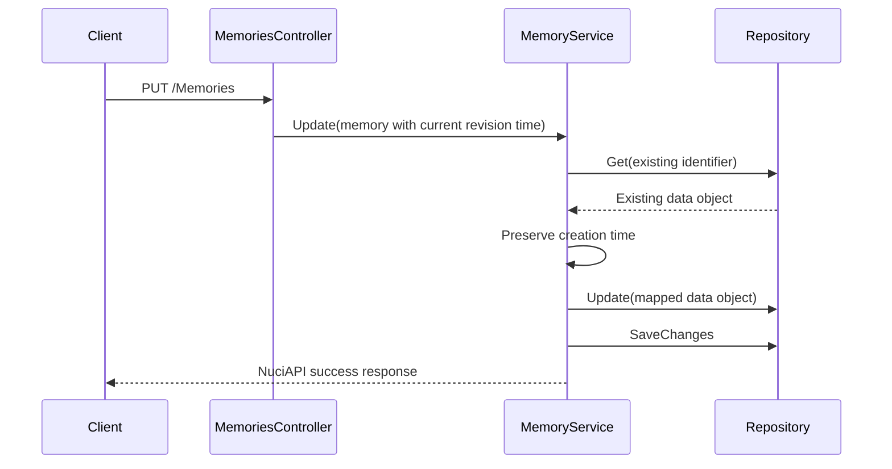
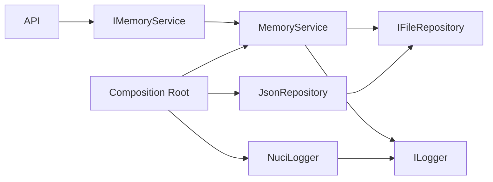

# GPT Memory Store Architecture

This document records the verified current architecture of GPT Memory Store: a self-hosted ASP.NET Core REST service that persists shared memory records in a local JSON file. It covers the runtime application and unit-test projects; it does not prescribe a future architecture or deployment topology.

## 📑 Table of Contents

- [Table of Contents](#table-of-contents)
- [Purpose](#purpose)
- [System Context](#system-context)
- [Architectural Style](#architectural-style)
- [Runtime Flow](#runtime-flow)
- [Components](#components)
- [Architectural Areas](#architectural-areas)
  - [HTTP API](#http-api)
  - [Application Service](#application-service)
  - [Persistence and Configuration](#persistence-and-configuration)
- [Data Architecture](#data-architecture)
- [Interfaces and Integrations](#interfaces-and-integrations)
- [Key Flows](#key-flows)
  - [Create Memory](#create-memory)
  - [Revise Memory](#revise-memory)
- [Cross-Cutting Concerns](#cross-cutting-concerns)
  - [Security and Privacy](#security-and-privacy)
  - [Error Handling](#error-handling)
  - [Observability](#observability)
  - [Configuration](#configuration)
  - [Concurrency and Resource Use](#concurrency-and-resource-use)
- [Dependency Direction and Rules](#dependency-direction-and-rules)
- [External Dependencies](#external-dependencies)
- [Deployment and Operations](#deployment-and-operations)
- [Compatibility Contracts](#compatibility-contracts)
- [Testing and Verification](#testing-and-verification)
- [Design Constraints](#design-constraints)
- [Extension Points](#extension-points)
  - [Memory Service and Repository](#memory-service-and-repository)
- [Architecture Decisions](#architecture-decisions)
- [Source Map](#source-map)
- [Related Documentation](#related-documentation)

## 🎯 Purpose

GPT Memory Store provides authenticated CRUD operations for a shared collection of memory records. This document identifies the owning layers, persistence boundary, and contracts that contributors must preserve when changing the API, service logic, or operational configuration.

## 🌐 System Context

API clients, including GPT Actions, issue HTTP requests to the service. The service authorises each controller action using a configured API key, records operation events, and uses the configured local filesystem for JSON persistence and optional file logging. The host and filesystem are separate trust boundaries: deployment personnel supply the secret and control access to persisted records and logs.



The principal external boundaries are:
- **API clients:** Invoke the `/Memories` HTTP contract and supply the shared API key; clients own request initiation and result handling.
- **Local filesystem:** Stores the JSON collection and optional logs at configured paths; the deployment environment owns durability and access permissions.
- **Configuration and secret source:** ASP.NET Core configuration supplies store, logger, and API-key settings; deployment personnel own the genuine secret value.

## 🏗️ Architectural Style

The application is a layered ASP.NET Core HTTP service. Controllers translate HTTP contracts to the `IMemoryService` application boundary, `MemoryService` maps domain records and orchestrates repository operations, and NuciDAL's JSON repository owns file persistence. Composition occurs in the host startup path, which registers each application collaborator as a singleton.



The principal architecture boundaries are:
- **HTTP API:** Depends on API request and response contracts, settings, and the service interface; it does not operate directly on the JSON repository.
- **Application service:** Depends on the repository and logger abstractions; it owns memory mapping and CRUD orchestration.
- **Persistence:** Receives `GptMemoryDataObject` instances through `IFileRepository`; JSON file representation remains behind the repository interface.
- **Composition:** Binds configuration, configures middleware, creates an absent store, and selects concrete singleton implementations.

## 🔄 Runtime Flow



The principal runtime sequence is:
1. `Program` constructs and runs the default ASP.NET Core host with `Startup`.
2. `Startup` binds configuration, registers singleton services, creates the configured store when missing, and orders request logging and exception handling before endpoint routing.
3. A controller action delegates the authorised request to `IMemoryService`, which maps records, persists mutations through `IFileRepository`, and emits operation logs.

## 🧩 Components

| Component | Responsibility | Principal Dependencies | Lifetime or Ownership |
|-----------|----------------|------------------------|-----------------------|
| `Program` and `Startup` | Create and configure the web host, middleware pipeline, data-store initialisation, and routes. | ASP.NET Core, configuration, DI container | Host-owned for process lifetime |
| `MemoriesController` | Define `/Memories` operations, construct request/response DTOs, and pass API-key authorisation to NuciAPI. | `IMemoryService`, `SecuritySettings`, NuciAPI controller base | Controller activation is owned by ASP.NET Core |
| `MemoryService` | Log, map, and execute create, retrieve, revise, and delete operations. | `IFileRepository<GptMemoryDataObject>`, `ILogger` | Singleton |
| `JsonRepository<GptMemoryDataObject>` | Persist memory data objects at the configured JSON path. | NuciDAL, `DataStoreSettings` path | Singleton |
| `NuciLogger` | Emit structured lifecycle events for memory operations. | `NuciLoggerSettings` | Singleton |

## 🗂️ Architectural Areas

### HTTP API

Paths:
- `GptMemoryStore/Api/Controllers`
- `GptMemoryStore/Api/Requests`
- `GptMemoryStore/Api/Responses`

Responsibilities:
- Accept routes and request bodies for memory CRUD operations.
- Convert domain models into the collection and individual read-response contracts.

Boundary rules:
- Controllers invoke `IMemoryService`; persistence is not accessed directly.
- API-key authorisation is supplied to every controller action through the NuciAPI controller base.

### Application Service

Paths:
- `GptMemoryStore/Service`
- `GptMemoryStore/Logging`

Responsibilities:
- Own CRUD orchestration, domain model representation, data-object mapping, and structured operation logging.
- Preserve the existing record's creation timestamp during revision.

Boundary rules:
- `MemoryService` uses repository and logger interfaces, not a concrete JSON store.
- Mapping between `GptMemory` and `GptMemoryDataObject` is internal to the service area.

### Persistence and Configuration

Paths:
- `GptMemoryStore/DataAccess`
- `GptMemoryStore/Configuration`
- `GptMemoryStore/ServiceCollectionExtensions.cs`

Responsibilities:
- Define the persisted data object and bind security, data-store, and logger settings.
- Select NuciDAL JSON persistence and logging implementations during composition.

Boundary rules:
- The configured store path is consumed when registering the JSON repository.
- Settings are bound and registered once during startup; the application does not implement runtime configuration reload.

## 💾 Data Architecture

`GptMemory` is the domain representation used by the service and read responses. `GptMemoryDataObject` is the persistence representation used by NuciDAL. The mapping serialises timestamps in an explicit round-trip date-time format, retaining a nullable updated timestamp. Creation assigns a generated GUID string and current local timestamp through the domain-model defaults; revision obtains the existing record to retain its creation timestamp, while the controller supplies the current local revision timestamp.

The application creates a missing store directory and an empty JSON array during startup. It owns neither file retention nor migration; those remain deployment responsibilities and no schema-version mechanism is implemented.



| Data or Store | Owner | Representation and Storage | Lifecycle or Consistency |
|---------------|-------|----------------------------|--------------------------|
| `GptMemory` | Application service | In-memory domain model with identifier, timestamps, content, source, and decimal confidence | Created with default identifier and creation time; revision preserves creation time |
| `GptMemoryDataObject` | Persistence boundary | NuciDAL entity with string timestamps in the configured JSON file | Written on each create, revise, or delete through `SaveChanges` |
| Memory-store file | Deployment environment | JSON array at `dataStoreSettings.memoryStorePath` | Initialised when absent; retained until deleted or replaced externally |

## 🔌 Interfaces and Integrations

| Interface or Integration | Direction | Contract | Owner | Failure Semantics |
|--------------------------|-----------|----------|-------|-------------------|
| Memory REST API | Inbound | `POST`, `GET`, `PUT`, and `DELETE` routes beneath `/Memories` | `MemoriesController` | NuciAPI request processing handles the controller boundary; service exceptions propagate to exception-handling middleware |
| `IFileRepository<GptMemoryDataObject>` | Outbound | NuciDAL repository operations: add, get, get all, update, remove, save changes | `MemoryService` | Repository exceptions are logged and rethrown by the service |
| JSON file persistence | Outbound | NuciDAL `JsonRepository` at the configured path | Composition and repository | File creation occurs at startup; later repository failures are propagated |
| Structured logging | Outbound | NuciLog operation/status events with optional file output | `MemoryService` | Logging occurs before and after service operations; logger failure handling is not defined by this repository |

## 🔀 Key Flows

### Create Memory



The controller deliberately constructs a fresh domain model rather than transferring a request identifier. The domain model supplies the identifier and creation time, and the service commits the mapped record in the same operation. A repository exception is recorded as a failure and rethrown.

### Revise Memory



Revision is ordered as retrieval, creation-time preservation, update, then save. An unknown identifier or any persistence failure interrupts the flow; the service logs it and rethrows it to the middleware boundary.

## 🧵 Cross-Cutting Concerns

### Security and Privacy

Every memory action creates `NuciApiAuthorisation.ApiKey` from `SecuritySettings.ApiKey` and gives it to `ProcessRequest`. The API key is a shared secret supplied through the application configuration contract. Memory content, source, confidence, identifiers, and operation counts may reach the JSON store and structured logs; deployment personnel must restrict filesystem access and provide secrets outside source control.

### Error Handling

`MemoryService` catches exceptions around each repository operation, writes a failure log event, and rethrows the original exception. `Startup` installs NuciAPI exception handling before routing, so translated HTTP failures are owned by that middleware rather than service code. The repository has no retry, fallback, transaction, or compensation logic in this project.

### Observability

`MemoryService` emits started, success, and failure events using `MyOperation` and `MyLogInfoKey`. Logged context includes operation identifiers and, for several operations, content, source, confidence, or result count. NuciLogger file output is controlled by configuration. No metrics, traces, health checks, or retention policy are implemented by this repository.

### Configuration

| Configuration Area | Source | Responsibility | Override or Secret Policy |
|--------------------|--------|----------------|---------------------------|
| `securitySettings` | ASP.NET Core configuration, with a template in `appsettings.json` | Shared API key for controller authorisation | Provide the genuine value from a trusted deployment secret source; do not commit it |
| `dataStoreSettings` | ASP.NET Core configuration | JSON memory-store path | Bound once at startup; path may be relative to the process working directory |
| `nuciLoggerSettings` | ASP.NET Core configuration | NuciLogger file destination and file-output activation | Bound once at startup; log location must be writable when file output is active |

### Concurrency and Resource Use

The repository, service, settings, and logger are registered as singletons. The application defines no explicit locking, request queue, transaction boundary, cache, or resource limit around its shared file repository. Concurrent write behaviour is therefore an integration property of NuciDAL's JSON repository and requires verification before relying on multi-writer deployment behaviour.

## 🧭 Dependency Direction and Rules

Dependencies proceed from HTTP contracts to the service abstraction, then from the service to logging and repository abstractions, and finally to concrete infrastructure selected in composition. The domain model and mapping do not depend on controller implementation; API response models depend on the domain model.



The principal dependency rules are:
- Controllers may depend on `IMemoryService`, settings, and HTTP DTOs; direct repository use is prohibited by the current layering.
- `MemoryService` may depend on `IFileRepository<GptMemoryDataObject>` and `ILogger`, while concrete infrastructure is registered only in the composition root.
- `GptMemoryDataObject` remains the persistence boundary; API request and response DTOs must not become repository entities.

## 📦 External Dependencies

| Dependency | Responsibility | Integration Boundary | Architectural Consequence |
|------------|----------------|----------------------|---------------------------|
| ASP.NET Core | Process hosting, routing, controllers, configuration, middleware, and DI | `Program` and `Startup` | Service lifecycle and HTTP pipeline follow the ASP.NET Core hosting model |
| NuciAPI packages | Controller processing, API-key authorisation, request logging, exception handling, and success responses | `MemoriesController` and `Startup` | HTTP behaviour and error translation depend on NuciAPI contracts |
| NuciDAL | File repository abstraction and JSON-backed repository implementation | `ServiceCollectionExtensions` and `MemoryService` | Persistent state is a local JSON file accessed through `IFileRepository` |
| NuciLog | Logging abstractions, configuration, statuses, and concrete logger | `MemoryService` and `ServiceCollectionExtensions` | Service operations emit structured lifecycle records |

## 🚀 Deployment and Operations

GPT Memory Store runs as one self-hosted ASP.NET Core process. It requires a reachable HTTP endpoint, a configured API key, and write access to the directory holding the JSON store; optional log output additionally requires write access to its configured log path. The process creates a missing store at startup but does not manage backups, replication, high availability, or cross-instance synchronisation.

| Concern | Current Design | Architectural Consequence |
|---------|----------------|---------------------------|
| Process topology | One ASP.NET Core web host | Availability and scaling are controlled outside this repository |
| Persistent state | Single local JSON file | Deployments must preserve the configured file separately from application replacement |
| Store initialisation | Startup creates missing directory and writes `[]` for an absent file | The process identity requires filesystem create and write permission at startup |
| Release automation | `release.sh` downloads and executes an external .NET release helper | Operators must review and trust the referenced deployment helper before execution |

## 🛡️ Compatibility Contracts

| Contract | Owner | Invariant | Verification | Change Policy |
|----------|-------|-----------|--------------|---------------|
| Memory HTTP routes | `MemoriesController` | CRUD operations remain exposed under `/Memories`; read responses supply memory fields and collection count | API-response unit tests cover response shape; manual HTTP verification is required for routes | Treat route and response changes as public API changes |
| Persisted timestamp format | Service mapping | Timestamps use `yyyy-MM-ddTHH:mm:ss.fffffffK`; the updated timestamp may be null | `MemoryServiceTests` verifies domain mapping of timestamps | Preserve readability of existing JSON records or provide an explicit data migration |
| Revision semantics | `MemoryService` | Revision retains the existing creation timestamp and stores the supplied revision timestamp | `MemoryServiceTests` verifies creation-time preservation | Maintain this invariant for any alternative repository or service implementation |
| Shared API-key authorisation | `MemoriesController` | Every action passes the configured API-key authorisation to NuciAPI | Manual authenticated and unauthenticated endpoint verification | Treat a change in credential shape or scope as an API security change |

## ✅ Testing and Verification

`GptMemoryStore.UnitTests` uses NUnit and Moq to verify `MemoryService` calls and mapping, timestamp preservation, repository exception propagation, and API response ordering and fields. Tests use mocked repository and logger dependencies; this repository contains no end-to-end HTTP, authorisation-middleware, JSON-persistence, concurrent-write, or filesystem-initialisation tests.

Execute the principal automated verification with:

```bash
dotnet test --verbosity normal
```

The GitHub Actions workflow performs `dotnet restore`, `dotnet build --no-restore`, and a no-build test command for pushes and pull requests to `master`.

## ⚠️ Design Constraints

- **Single local store:** All records reside in one configured JSON file; durability, backup, and deployment replacement procedures are external operational responsibilities.
- **Shared-secret authorisation:** One API key controls every memory operation; no roles, tenants, or scoped permissions are implemented.
- **Unbounded collection reads:** The collection route returns all records and provides no filtering or pagination parameters.
- **No configured retention:** Memory records remain until deletion, and logger retention is external to the application.
- **Singleton file infrastructure:** Shared services rely on the repository implementation for concurrent file access semantics; the application adds no coordination.
- **Immutable startup settings:** Settings are bound into singleton instances during startup, so configuration changes require a process restart.

## 🔧 Extension Points

### Memory Service and Repository

1. Implement or revise `IMemoryService` or `IFileRepository<GptMemoryDataObject>` as appropriate.
2. Register the concrete implementation in `AddCustomServices` within `ServiceCollectionExtensions`.
3. Add unit and integration verification for CRUD, timestamp, persistence, and error-propagation contracts.

Alternative repository implementations must preserve the data-object identifier and timestamp contract, and alternative service implementations must preserve the CRUD behaviour exposed by `MemoriesController`. The registered lifetime must be selected deliberately because the current implementations are singletons.

## 📝 Architecture Decisions

| Decision | Rationale | Consequence | Record |
|----------|-----------|-------------|--------|
| Use a JSON-backed file repository | The service persists shared memories without a database dependency. | Durable state is local-file dependent and operationally managed. | Documented here |
| Use a layered controller-service-repository structure | HTTP processing, memory operations, and persistence are separated through explicit interfaces. | Controllers do not directly own persistence, and infrastructure can be replaced at composition. | Documented here |
| Preserve creation time on revision | A revision represents a modification of the existing memory rather than a new record. | `Update` must retrieve the existing record before saving. | Documented here |

## 🗺️ Source Map

| Area | Path |
|------|------|
| Host composition and middleware | [GptMemoryStore/Program.cs](GptMemoryStore/Program.cs), [GptMemoryStore/Startup.cs](GptMemoryStore/Startup.cs), [GptMemoryStore/ServiceCollectionExtensions.cs](GptMemoryStore/ServiceCollectionExtensions.cs) |
| HTTP contracts | [GptMemoryStore/Api](GptMemoryStore/Api) |
| Application service and domain mapping | [GptMemoryStore/Service](GptMemoryStore/Service) |
| Persistence model and settings | [GptMemoryStore/DataAccess](GptMemoryStore/DataAccess), [GptMemoryStore/Configuration](GptMemoryStore/Configuration) |
| Service and response tests | [GptMemoryStore.UnitTests](GptMemoryStore.UnitTests) |
| Continuous integration | [.github/workflows/dotnet.yml](.github/workflows/dotnet.yml) |

## 📚 Related Documentation

- [README.md](README.md) contains installation, configuration, HTTP usage, privacy, deployment, and release guidance.
- [LICENSE](LICENSE) defines the GNU General Public License v3.0 terms for the repository.
